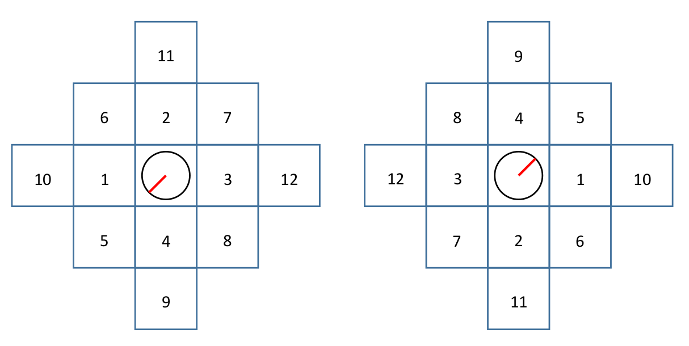

# AMCL wake-up self-recovery
## Video Demo
(Recommended) See the demo running in simulation with dynamic obstacle [here](https://youtu.be/sMLQHKnkByA). You may want to skip the first 60 seconds, which is just global initialization.

See the demo running in real world [here](https://youtu.be/afoSvsJPn9E).

## Set Up
* Ubuntu 18.04
* ROS-melodic
* Turtlebot3-burger
* LDS-01 lidar

## Dependency
* ROS-melodic-move-base
* Gazebo Plugin (optional)

## Table of Contents
- [0. Build Gazebo Plugin (optional)](#Build-Gazebo-Plugin)
- [1. Run the package](#Run-the-package)
- [2. Project Objective](#Project-Objective)
- [3. Project Pipeline](#Project-Pipeline)
- [4. Background](#Background)
- [5. Method](#Method)
  * [Grid Map Searching](#Grid-Map-Searching)
  * [Experimental Results](#Experimental-Results)
  * [Drawbacks](#Drawbacks)
- [6. Acknowledgement](#Acknowledgement)

## Build Gazebo Plugin
I modified the [gazebo_animatedbox_tutorial](http://gazebosim.org/tutorials?tut=animated_box) package to simulate dynamic obstacles. You can change the source code in **animated_box.cc** to generate customized obstacles. To build the package:
```
$ cd gazebo_animatedbox_tutorial/
$ mkdir build
$ cd build && cmake .. && make
```
Then add your CURRENT_PATH under the **build** directory to your $GAZEBO_PLUGIN_PATH in your **.bashrc**:
```
export GAZEBO_PLUGIN_PATH=CURRENT_PATH:$GAZEBO_PLUGIN_PATH
```
Then such plugin can be used in simulation.

## Run the package
If you want to run it in **simulation**, you may need get gazebo installed and run:
```
$ roslaunch amcl_wakeup world_amcl_wakeup.launch
```

and then load the map file:
```
$ roslaunch amcl_wakeup turtlebot3_navigation.launch map_file:=/home/zhicheng/turtlebot3ws/src/amcl_wakeup/maps/map_asym_longhallway_2.yaml
```

Otherwise if you run this package in **real world**, just run:
```
$ roslaunch amcl_wakeup turtlebot3_navigation.launch map_file:=$PATH_TO_YOUR_MAP
```

Now a customized AMCL should be running (no difference from the raw AMCL package except that **amcl_wakeup** node publishes some topics necessary for this project).

To do global initialization, just call AMCL built in service:
```
$ rosservice call /global_localization "{}"
```

If you get multiple uncertain state clusters, now it's the time to wake up the robot!
```
$ roslaunch amcl_wakeup wakeup.launch
```


## Project Objective
This project focuses on solving **robot wake up problem** of AMCL. To be specific, it aims at helping AMCL self-recover from several potential initial states guesses just based on given map and laser scan sensor.

## Project Pipeline
<b> </b><br>

<p align = "center">
  
</p>
<p align="center">
  <b>Fig 1. Project Pipeline </b><br>
</p>

## Background
**Robot wake up problem** is known as a specific case of **robot kidnapped problem**, which refers to
the situation that the robot is carried to an arbitrary location and the robot has to relocate its
state without any prior knowledge. This problem is also a common case when a robot is boot
up without setting its initial state. A failure of this problem may raise up when the map has
multiple duplicate or symmetric structures, in which case AMCL may result in multiple
potential state hypotheses, as shown in **Fig 3**.

<p align = "center">
  
</p>
<p align="center">
  <b>Fig 2. AMCL with multiple potential states </b><br>
</p>

## Method
This method is only based on **2D laser scan** and **map features**. The idea is simple: Since the map is given, the robot itself is going to find out the states with different map features and drive itself there, then based on the true sensor reading, AMCL will drop out less likely potential state. The robot will iterate such step until AMCL converges.

For example, assuming we have a robot located at the bottom left of the given map as shown in Fig 3. After the robot is boot up without any information about initial state, AMCL global initialization will result into three potential states. In such scenario, the sensor reading under these three states look pretty similar. For convenience, we denote that the potential states **x<sub>1</sub>**, **x<sub>2</sub>** and **x<sub>3</sub>** form a **current potential states set X<sub>0</sub>**.

<p align = "center">
  
</p>
<p align="center">
  <b>Fig 3. Robot running in a 2D grid map, where green points denote particles</b><br>
</p>

To recover from such wake-up failure, the robot is going to generate a new potential states set G1, which represents the fake potential states derived by taking the same control for each state in G0. For each fake new state, as shown in Fig 4(a), we can observe that the sensor reading at x<sub>2'</sub> look quite different from that at **x<sub>1'</sub>** and **x<sub>3'</sub>**. Thus if the robot gets there AMCL will automatically drop out the potential state cluster **x<sub>2</sub>**, while potential states clusters **x<sub>1</sub>** and **x<sub>3</sub>** still remain because the sensor readings at those states still look similar, shown as Fig 4(b).

<p align = "center">
  
</p>
<p align="center">
  <b>Fig 4(a). Fake potential states set and sensor readings, where orange arrows denote the control</b><br>
</p>

<p align = "center">
  
</p>
<p align="center">
  <b>Fig 4(b). After taking the same control, state cluster x<sub>2</sub> is dropped out, but the other two still exist</b><br>
</p>

To eliminate the remaining potentialty, the robot will just do the same step as above again to find a new control, which will make two potential states to have different simulated sensor readings. Again, after taking that control, the AMCL will converge to state **x<sub>1</sub>** , which is the true state of the robot.

<p align = "center">
  
</p>
<p align="center">
  <b>Fig 5(a). Fake potential states set and sensor readings, where orange arrows denote the control</b><br>
</p>

<p align = "center">
  
</p>
<p align="center">
  <b>Fig 5(b). After taking the same control, AMCL finally converge to true state x<sub>1</sub></b><br>
</p>

### Grid Map Searching
As implied above, we have to find the **control** which can take the old state cluster set to a new one which consists of states where the lidar sensor can get different readings. Actually we don't necessarily need to find out the **control**, instead it will be much easier to find the new potential states set with that feature. To do this, for the current potential states set, we can do **grid map searching** to figure this out.

<p align = "center">
  
</p>

<p align="center">
  <b> &#160 &#160  (a) potential state x<sub>1</sub> with its searching grids and order &#160  (b) potential state x<sub>2</sub> with its searching grids and order </b><br>
  <b>Fig 6. After taking the same control, AMCL finally converge to true state x<sub>1</sub></b><br>
</p>

As shown in Fig 6, we use two potential states **x<sub>1</sub>** and **x<sub>3</sub>** as examples from the previous case. For the first searched grids pair (two grids marked with index 1), each one's relative transformation to its corresponding potential state is the same as another one's. The searching processes in a **inflating spiral** order with its center at each potential state.

In each searching iteration, a new potential states set is generated. We pick one state from the new potential potential states set and generate its fake sensor reading **z<sub>fake** based on the given map **m**. Then for each potential state in the current searching potential states set we calculate the score **p(z<sub>fake</sub> | map, x<sub>i</sub>)** for all potential state **x<sub>i**. To figure out if there exists a big difference among them, we calculate the maximum L2 distance. If the maximum L2 distance **D<sub>L2</sub> > ε**, where **ε** is a preset threshold, the searching terminates and the robot will navigate to that state.

The implementation of such idea looks like this with a little difference:

<p align = "center">
  
</p>

<p align="center">
  <b>Fig 7. Grid Map Searcing </b><br>
</p>


### Experimental Results
Since this method only cares about static map, it’s not hard to capture the potential states set with ‘featured states’ in static environment. Once the ‘featured states’ are captured, AMCL always converges well when the robot gets there, as can be observed in the video. The speed of convergence depends on the threshold **ε**. How to set **ε** should depend on the task (e.g. the further we allow the robot to move, the larger **ε** can be set, because when the grid map searching gets further, it has larger probability to capture the featured states
with big difference).

Also since we only do ray casting once in each iteration, the computation complexity is not that large. It should be fine to run this package on-chip only if the remote PC is relatively powerful.

### Drawbacks
So far there are two drawbacks in this proposal:
1. It won’t work in **a completely central symmetric map**. (results from the critical drawback of AMCL itself)

2. It is not suitable for the scenario where robots have limitations on movements after being boot up.

3. Since the global initialization is required, the number of initial particles needs to be quite large to capture all potential states, otherwise the true state may be lost. This results in a slow convergence at the beginning, thus this method is not suitable for the scenario where the robot has to locate itself quickly after boot up.

## Acknowledgement
This is a final project done by Zhicheng Yu during his final quarter in MSR (Master of Science in Robotics) program at Northwestern University. It is supervised by Prof. Ying Wu and Prof. Matthew Elwin, who gave many valuable intuitions and considerations on this project.

Also, it will be helpful to look up to raw AMCL ROS repo and AMCL papers:

1.[amcl-ROS Wiki](http://wiki.ros.org/amcl)

2.[Monte Carlo Localization: Efficient Position Estimation for Mobile Robots](http://robots.stanford.edu/papers/fox.aaai99.pdf)

3.[KLD-Sampling: Adaptive Particle Filters](https://papers.nips.cc/paper/1998-kld-sampling-adaptive-particle-filters.pdf)
